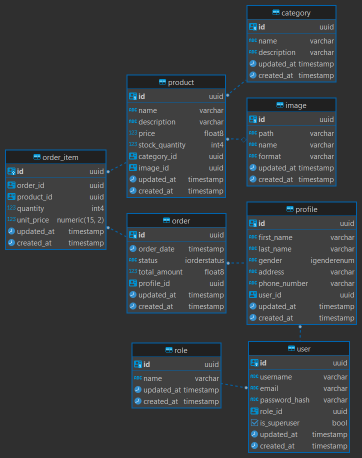
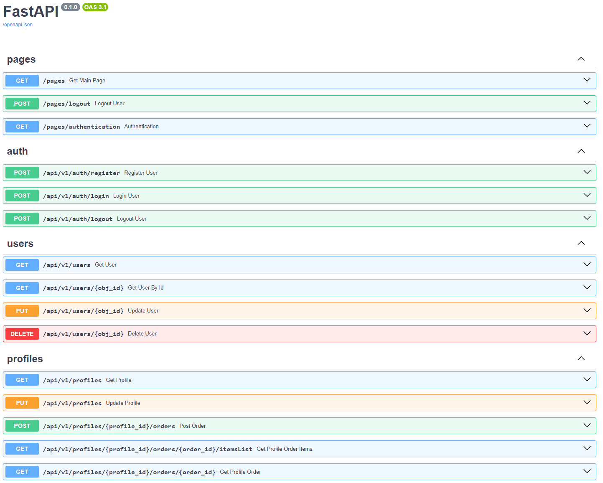
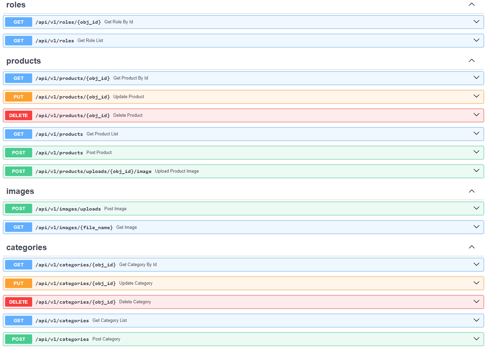

# FastAPI Learning Project

## Обзор
Этот пет-проект демонстрирует навыки разработки API с использованием технологии FastAPI. На данный момент проект находится в стадии разработки.

## Цель и задачи проекта
Цель проекта - реализовать базовый функционал интернет магазина. 
Функционал включает:
- Аутентификацию и авторизацию пользователей;
- Инструменты управления товарами;
- Функционал создания заказа пользователем;
- Базовый пользовательский интерфейс.

## Реализованно
- **API**: Структурированные маршруты и эндпоинты API с использованием FastAPI;
- **CRUD**: Операции создания, чтения, обновления и удаления записей;
- **База данных**: Для хранения данных используется PostgreSQL;
- **Развертывание**: Приложение контейнеризируется с помощью Docker;
- **Модели базы данных**: Созданы модели базы данных с помощью SQLAlchemy;
- **Валидация данных**: Pydantic схемы для проверки данных запросов и ответов;
- **Аутентификация и авторизация**: Управление аутентификацией пользователей с использованием JWT токенов и контролем доступа на основе ролей;
- **Миграции**: Использование технологии миграции базы данных alembic;
- **Testing**: Unit тестирование функций с использованием pytest;
- **Exception Handling**: Обработка пользовательских исключений.

## Содержание
1. [Развертывание](#Развертывание)
2. [Схема базы данных](#схема-базы-данных)
3. [Документация API](#документация-api)

## Развертывание

### Необходимые технологии
- Docker
- Python 3.11+

### Установка и настройка
1. **Клонировать репозиторий**
   ```bash
   git clone https://github.com/denis-kosobanov/fastApi-learn.git
   cd fastApi-learn

2. **Запуск Docker**
   ```bash
   docker-compose -f docker-compose-dev.yaml up --build
   
3. **Главная страница**
 http://localhost:8000/pages

## Схема базы данных



## Документация API

После запуска приложения http://localhost:8000/docs




## Contact
Denis Kosobanov

Email: kosobanovden@mail.ru

Project Link: https://github.com/denis-kosobanov/fastApi-learn
